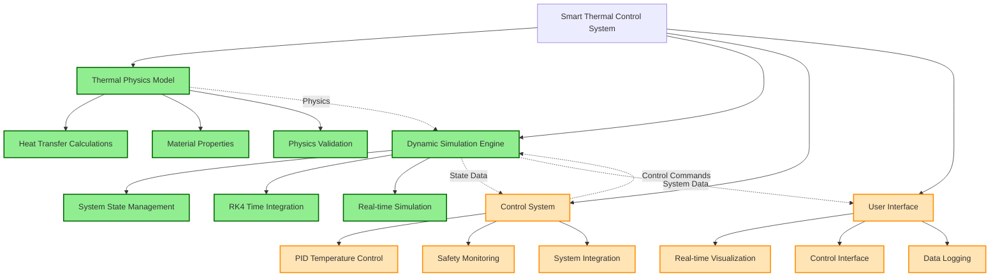

# Smart Thermal Control System

**Medical-grade temperature control system for critical blood storage applications**

## Overview

This system provides automated, precise temperature control for safety-critical blood storage scenarios:

- **Blood Banks & Hospitals**: Whole blood and red blood cell storage (1-6°C)
- **Plasma Centers**: Fresh frozen plasma storage (-18°C or below)  
- **Mobile Blood Units**: Temperature-controlled transport containers
- **Emergency Medical Services**: Portable blood storage for field operations
- **Research Facilities**: Temperature-sensitive blood component storage

## Engineering Focus

**System Design Philosophy**: Medical-grade precision with modular architecture for safety-critical temperature management applications.

**Key Engineering Challenges Addressed:**
- Thermal physics modeling for multi-component blood products
- Control system design for precise temperature regulation
- FDA regulatory compliance validation and safety protocols
- Real-time system monitoring and automated safety responses

## Technical Implementation

### Core Engineering Components

**Thermal Physics Engine**
- Heat transfer calculations (conduction, convection, radiation)
- Material properties database for blood components
- Numerical integration using RK4 methods for real-time simulation

**Control Systems Architecture**
- PID controller implementation for temperature regulation
- Safety monitoring with automated limit checking
- Modular control interfaces for system integration

**System Validation**
- Comprehensive unit testing framework
- FDA blood storage regulation compliance verification
- Performance optimization for numerical stability

## System Architecture

## Technical Skills Demonstrated

**Systems Engineering**
- Modular architecture design for complex engineering systems
- Requirements analysis and regulatory compliance research
- System integration and validation methodologies

**Control Systems**
- PID controller design and implementation
- Real-time control system architecture
- Safety-critical system design principles

**Computational Engineering**
- Thermal physics modeling and heat transfer analysis
- Numerical methods implementation (RK4 integration)
- Performance optimization for real-time applications

**Software Engineering**
- Object-oriented design patterns
- Comprehensive testing frameworks
- Documentation and code organization

## Development Status

### ✅ Phase 1: Thermal Physics Model (Completed)
- Comprehensive heat transfer calculations implemented
- Material properties database for blood components
- Physics model validation and testing

### ✅ Phase 2: Dynamic Simulation (Completed) 
- Time-stepping simulation engine with RK4 integration
- System state management and real-time modeling
- Simulation framework testing and validation

### 🔄 Phase 3: Control System Design (In Progress)
- PID controller implementation for temperature regulation
- Safety monitoring and automated limit checking systems
- Closed-loop control integration with simulation engine

### 📋 Phase 4: User Interface Development (Planned)
- Real-time temperature visualization and system monitoring
- Control parameter adjustment interfaces
- Safety status displays and alarm systems

### 📋 Phase 5: System Integration & Validation (Planned)
- End-to-end system testing with realistic scenarios
- Performance optimization and stability validation
- Complete documentation and deployment preparation

## Project Applications

**Healthcare Technology**: Demonstrates understanding of medical device requirements and safety-critical system design

**Control Systems**: Shows practical application of control theory to real-world engineering challenges

**Thermal Engineering**: Exhibits thermal physics modeling and heat transfer analysis capabilities

**Systems Integration**: Illustrates ability to design and implement complex multi-component engineering systems

---

**Note**: This project is developed for educational and portfolio purposes. Any medical applications would require proper validation, testing, and regulatory approval.
