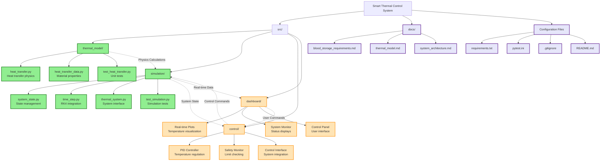

# Smart Thermal Control

**A Python-based temperature control system for critical blood storage applications**

## Project Overview

This system provides automated, precise temperature control for critical blood storage scenarios including:

- Blood Banks & Hospitals: Whole blood and red blood cell storage (1-6°C)
- Plasma Centers: Fresh frozen plasma storage (-18°C or below)
- Mobile Blood Units: Temperature-controlled transport containers
- Emergency Medical Services: Portable blood storage for field operations
- Research Facilities: Temperature-sensitive blood component storage

Think of it as a medical-grade smart thermostat with the precision and reliability required for blood storage applications.

## Development Approach & Transparency

This project was developed using modern AI-assisted engineering workflows as a learning exercise in software development and control systems design. The development process involved:

**My Engineering Contributions:**
- **Problem Definition**: Identified blood storage thermal control as a complex, safety-critical challenge
- **System Architecture**: Designed modular structure separating thermal physics, control algorithms, and simulation
- **Requirements Research**: Verified FDA blood storage regulations and medical device standards
- **Technical Direction**: Guided AI code generation through iterative prompting and requirements refinement
- **Code Review & Validation**: Reviewed, tested, and modified all generated code to ensure correctness
- **Integration & Testing**: Ensured all components work together 

**AI-Assisted Implementation:**
- Code generation for thermal physics calculations and data structures
- Unit test framework development and test case implementation
- Documentation structure and technical writing
- Boilerplate code and standard software engineering patterns

**My Role**: Engineering lead and technical reviewer - responsible for all design decisions, requirements validation, and quality assurance. Can explain and defend the system design and implementation.

## Project Disclaimer

**Important**: While this project aims for medical-grade precision, it is developed for self-learning purposes and should not be used in actual medical applications without proper validation, testing, and regulatory approval.

## Technical Skills Demonstrated

- **AI-Assisted Development**: Effective collaboration with AI tools for rapid prototyping
- **System Design**: Modular architecture for complex engineering systems
- **Domain Research**: Understanding medical device requirements and thermal physics
- **Code Review**: Validating and improving AI-generated implementations
- **Quality Assurance**: Testing applications

## Project Structure

## Module Descriptions

### `src/thermal_model/`
Contains the core heat transfer physics calculations:
- **heat_transfer.py**: Heat transfer mechanisms (conduction, convection, radiation)
- **heat_transfer_data.py**: Material properties and blood product specifications
- **test_thermal_model.py**: Unit testing

### `src/simulation/`
Dynamic system simulation and modeling:
- **system_state.py**: System state management
- **time_step.py**: Time-based temperature evolution using RK4 and physics model
- **thermal_system.py**: Controller interface
- **test_simulation.py**: Unit testing

### `src/controller/`
Temperature control algorithms and safety systems:
- Control logic (PID)
- Safety monitoring and limits
- Control system interfaces

### `src/dashboard/`
User interface and system monitoring:
- Real-time temperature displays
- Control parameter adjustment
- Data logging and visualization

## Development Timeline

### Phase 1: Thermal Physics Model (Completed 06/09/2025)
- Built comprehensive heat transfer calculations
- Created material properties library

### Phase 2: Dynamic Simulation (Completed 06/15/2025)
- Building time-stepping simulation engine
- Creating realistic thermal system models

### 📋 Phase 3: Control System Design (Not Started Yet)
- Implementing PID controller for precise temperature regulation
- Creating safety monitoring and automated limit checking
- Designing cooling/heating system model
- Integrating closed-loop control with simulation engine

### 📋 Phase 4: User Interface & Dashboard (Not Started Yet)
- Building real-time temperature visualization and monitoring
- Creating control parameter adjustment interface
- Implementing safety status displays and alarm systems

### 📋 Phase 5: Integration & Validation (Not Started Yet)
- End-to-end system testing with realistic blood storage scenarios
- Performance optimization and numerical stability validation
- Documentation finalization